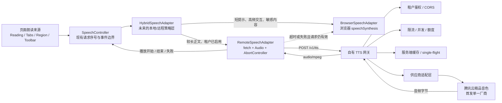

# 云端 TTS 后续开发方案（提案）

> - 文档状态：Draft / living document
> - 初始日期：2026-08-03
> - 适用版本：v0.1.0 之后的未来立项
> - 当前产品状态：**尚未支持云端 TTS，本文件不代表现有功能或稳定 API**

## 1. 目标与结论

本提案记录未来接入云端语音合成（TTS）的推荐架构、接口边界和实施顺序，供后续立项、成本评审、安全评审与开发使用。当前 v0.1.0 继续默认使用浏览器 `speechSynthesis`；工具代码本身不发起语音网络请求，也不会主动上传页面内容或朗读文本。浏览器或操作系统提供的具体语音引擎是否联网属于运行环境行为，工具无法替其作出保证。

推荐结论：

- 前端不直接调用云厂商，也不持有厂商密钥。
- 未来由 `RemoteSpeechAdapter` 调用接入方自有的 TTS 网关。
- 网关首版只接入一个云厂商，建议优先验证腾讯云精品音色。
- 高频、短文本和键盘焦点提示继续使用浏览器本地语音；较长正文在接入方明确启用后才使用云端语音。
- 云端超时、限流、服务错误、音频解码或播放失败时，只要请求仍是当前请求，就自动降级到 `BrowserSpeechAdapter`。
- 用户已经移动焦点、主动取消或请求已经过期时，必须静默丢弃结果，不能再触发本地降级朗读旧内容。
- 后端保留供应商适配层，但首版不实现多厂商自动容灾。

## 2. 推荐架构



核心数据流：

```text
文本与朗读参数
  → SpeechController
  → HybridSpeechAdapter 决策
  → RemoteSpeechAdapter
  → 自有 /v1/tts 网关
  → 单一云厂商适配器
  → 音频响应
  → 前端播放
  → 失败时本地降级
```

安全边界：浏览器只知道自有网关地址和短期租户令牌；云厂商密钥、供应商请求协议、计费规则、缓存与配额全部留在网关侧。

## 3. 当前可复用的前端扩展点

当前代码已经提供一个足以承载原型的适配器边界，但尚未实现远程请求：

| 现有组件 | 当前行为 | 未来可复用方式 |
| --- | --- | --- |
| `SpeechAdapter` | 提供返回 `void` 的 `speak(text, options)`、`cancel()` 和同步 `isSupported()` | `RemoteSpeechAdapter` 或 `HybridSpeechAdapter` 实现同一接口，通过现有 `speech.adapter` 注入 |
| `SpeechConfig.adapter` | 可在工具打开前配置自定义适配器 | 接入方构造包含网关地址、令牌提供器和本地降级实例的适配器 |
| `SpeechController` | 每次朗读递增 `requestId` 并先调用适配器 `cancel()`；显式取消也会递增序号；过期的开始、结束和错误回调均被忽略 | 继续作为统一朗读入口和最终 `speechstart` / `speechend` / `error` 事件边界 |
| `BrowserSpeechAdapter` | 检查 `SpeechSynthesisUtterance` / `speechSynthesis` 后调用浏览器语音，并把开始、结束、错误映射到回调 | 保留为短提示默认实现及远程失败降级 |
| `SpeechRequestOptions` | 现有字段为 `lang`、`rate` 和开始/结束/错误回调 | 首个原型可直接映射；若后续需要明确 `purpose`、敏感级别或缓存策略，应另立 API 变更决策 |

需要明确的限制：

- `SpeechAdapter.speak()` 当前返回 `void`。远程适配器可以在方法内部启动异步请求，但必须自行维护 `AbortController`、音频元素、对象 URL 和请求代次。
- `SpeechController` 的 `requestId` 能阻止旧回调污染工具状态，但不能自动终止网络请求，也不能阻止适配器播放已经返回的旧音频；这部分必须由远程适配器负责。
- `SpeechAdapter.isSupported()` 是同步能力检查，不能探测实时网络、令牌有效性或网关健康。远程实现只能检查必要浏览器能力和静态配置；混合实现应在本地或远程至少一个通道具备静态能力时返回 `true`，运行期故障再走降级规则。
- `SpeechController` 会把适配器传出的 `onError` 当作最终朗读错误。混合适配器必须在内部吸收可降级的远程错误，直接调用本地适配器完成同一请求；只有本地降级也失败时才向外触发一次 `onError`，不能递归调用 `SpeechController.speak()`。
- `onStart` 应在音频真正开始播放时触发，而不是在开始请求网关时触发。
- 当前适配器在运行时创建后不会自动热切换。站点应在 `open()` 前配置；是否支持运行时切换属于后续 API 议题。
- 现有请求参数没有“焦点提示/正文/敏感内容”等上下文。首个验证版本可以用长度阈值和明确的本地规则决策；若需要更稳定的语义策略，再扩展类型并补充兼容方案。

## 4. 混合朗读策略

### 4.1 默认路由

| 内容类型 | 默认通道 | 原因 |
| --- | --- | --- |
| 工具栏状态、区域进入、选项卡、按钮和表单焦点提示 | 浏览器本地语音 | 高频且要求低延迟；文本短；避免键盘操作等待网络 |
| 密码、验证码、支付字段、显式敏感节点 | 按当前规则不朗读 | 不应发送到云端；若未来另立产品决策允许某类敏感提示，也只能走浏览器语音 |
| 较长正文、用户明确发起的长文本朗读 | 云端语音（租户启用后） | 更适合使用稳定音色，同时可通过缓存降低重复成本 |
| 离线、网关不可达、租户未启用或额度耗尽 | 浏览器本地语音 | 保持基础可用性 |

“较长正文”的首版阈值不在本文中冻结。建议在真实页面和目标浏览器上测量后确定，并允许接入方配置。若仅根据字符数决策，应避免把短但高频的焦点提示发送到云端。

### 4.2 失败与降级矩阵

| 情况 | 前端行为 |
| --- | --- |
| 网络失败、超时、HTTP 429/5xx | 当前请求仍有效时，取消远程播放资源并使用本地语音朗读同一文本；本地降级成功时不向 `SpeechController` 上报最终错误 |
| 401/403 或租户配置错误 | 当前请求仍有效时本地降级，同时记录不含正文的内部诊断事件，提示接入方修复配置；降级成功时不触发公开 `error` 事件 |
| 返回内容类型错误、音频过大、解码或播放失败 | 释放音频资源；当前请求仍有效时本地降级 |
| 用户切换焦点、触发新朗读或调用 `cancel()` | 中止请求和播放，静默结束；不得朗读旧文本，也不得触发降级 |
| 远程响应在截止时间后到达 | 静默丢弃并释放资源；不得播放或降级 |
| 浏览器本地语音也不可用 | 触发现有错误边界，不伪造成功事件 |

降级不是多厂商容灾。首版远程失败只回到浏览器语音，不自动改调第二家云厂商。

## 5. 组件职责

### 5.1 前端

**`SpeechController`（现有）**

- 保持唯一朗读入口、事件触发和过期回调保护。
- 新请求开始前取消旧请求。
- 不感知具体云厂商、鉴权协议或缓存策略。

**`HybridSpeechAdapter`（未来建议）**

- 根据远程开关、内容类别、文本长度、敏感策略和运行环境选择本地或远程通道。
- 保证本地和远程通道不会并发发声，且成功路径只向外产生一组开始/结束回调。
- 在符合降级条件时，在适配器内部把同一请求交给 `BrowserSpeechAdapter`，不递归进入 `SpeechController`。
- 远程失败但本地降级成功时，只记录内部降级指标，不调用外层 `onError`；两个通道都失败时才上报一次最终错误。
- `cancel()` 必须同时使远程 generation 失效、中止 fetch、停止音频并取消可能已经启动的浏览器降级。

**`RemoteSpeechAdapter`（未来建议）**

- 从接入方提供的异步令牌函数获取短期网关令牌。
- 调用 `/v1/tts`，校验状态码、响应类型和最大音频大小。
- 使用 `AbortController` 取消网络请求。
- 使用 `Audio` 播放返回的音频 Blob；开始播放后才触发 `onStart`。
- 在结束、错误或取消时停止音频、清空 `src` 并调用 `URL.revokeObjectURL()`。
- 用自己的 generation/request token 再次检查响应是否仍属于当前请求。
- 不在浏览器持久化正文或音频；首版仅允许当前页面内存中的短生命周期对象。

**`BrowserSpeechAdapter`（现有）**

- 继续负责默认本地朗读。
- 作为远程失败后的最后可用通道。

### 5.2 自有 TTS 网关

网关应保持轻量、无业务页面知识，但集中承担以下职责：

- 验证租户令牌、来源站点、权限范围与令牌有效期。
- 校验文本长度、语言、音色别名、语速、格式和超时参数。
- 施加请求速率、并发数、字符额度和成本预算限制。
- 将稳定的内部音色别名映射到供应商音色 ID。
- 使用供应商适配层调用腾讯云，并隔离厂商 SDK、签名与错误码。
- 执行服务端缓存、single-flight、防止相同文本并发击穿。
- 在客户端断开或截止时间到达时尽力取消上游请求；无法取消时丢弃结果。
- 返回受控格式的音频字节，不向浏览器暴露厂商密钥或原始响应。
- 记录延迟、状态、缓存命中、计费字符和供应商请求 ID，但默认不记录正文。

### 5.3 供应商适配层

供应商适配层的内部输入输出应稳定，至少隔离：

- 音色别名与供应商音色 ID。
- 语速、采样率和音频格式参数差异。
- 供应商鉴权和 SDK 生命周期。
- 超时、取消、错误码和可重试判断。
- 供应商返回的计费单位、请求 ID 和音频载荷。

首版只有腾讯云实现。增加第二家厂商、自动切换或跨厂商一致性测试需要新的 ADR 和独立任务。

## 6. `/v1/tts` 协议草案

本节是未来网关的讨论起点，不是当前稳定 API。

### 6.1 请求

```http
POST /v1/tts HTTP/1.1
Authorization: Bearer <short-lived-tenant-token>
Content-Type: application/json
Accept: audio/mpeg
X-Request-Id: <uuid>
```

```json
{
  "text": "需要朗读的正文",
  "language": "zh-CN",
  "voice": "zh-CN-premium-default",
  "rate": 1,
  "format": "mp3",
  "purpose": "content",
  "cacheMode": "tenant",
  "timeoutMs": 3500
}
```

字段建议：

| 字段 | 要求 |
| --- | --- |
| `text` | 必填；非空；服务端按供应商限制设置最大字符数，超出返回 413；不得从 HTML 字符串中自行提取正文 |
| `language` | BCP 47 语言标签；首版至少支持配置的中文路径，未知值拒绝或映射到租户默认值 |
| `voice` | 网关定义的稳定别名，不直接暴露腾讯云音色 ID |
| `rate` | 与当前工具语速范围保持一致，由网关再次校验和钳制 |
| `format` | 首版建议固定 `mp3` / `audio/mpeg`，降低浏览器兼容成本 |
| `purpose` | 首版仅用于策略和指标，不作为鉴权来源；建议值为 `content` |
| `cacheMode` | `tenant` 或 `no-store`；只是客户端请求提示，网关必须按令牌权限和服务端数据策略收紧，敏感或一次性内容必须使用 `no-store` |
| `timeoutMs` | 客户端期望的相对截止时间；网关必须设置自己的最小值和最大值，不能完全信任客户端 |

租户 ID 不应从 JSON body 接受，必须从已验证令牌中取得。

### 6.2 成功响应

首版建议直接返回音频字节，避免生成可转发的公开音频 URL：

```http
HTTP/1.1 200 OK
Content-Type: audio/mpeg
Content-Length: 123456
Cache-Control: no-store
X-Request-Id: <uuid>
X-TTS-Provider: tencent
X-TTS-Cache: HIT
X-TTS-Voice-Version: 2026-08
```

说明：

- `Cache-Control: no-store` 约束浏览器和中间代理，不影响网关内部受控缓存。
- 客户端必须校验 `Content-Type`、长度上限和请求 ID，再创建音频对象 URL。
- 首版不返回长期签名 URL，不把音频写入 IndexedDB 或 Cache Storage。
- 若未来采用流式音频、分段播放或对象存储签名 URL，需要版本化协议。

### 6.3 错误响应

```http
HTTP/1.1 429 Too Many Requests
Content-Type: application/problem+json
Retry-After: 2
```

```json
{
  "type": "https://gateway.example.com/problems/tts-rate-limited",
  "title": "TTS request rate limited",
  "status": 429,
  "code": "RATE_LIMITED",
  "requestId": "<uuid>",
  "retryable": true,
  "retryAfterMs": 2000
}
```

建议状态码：

- `400`：参数无效。
- `401`：令牌无效或过期。
- `403`：租户、来源或功能未授权。
- `413`：文本超过单次限制。
- `429`：请求、并发或额度限制。
- `502`：供应商错误或响应无效。
- `504`：网关或供应商超时。

错误消息不得回显完整正文、厂商密钥或供应商原始敏感响应。

## 7. 取消、超时与过期响应

### 7.1 前端规则

每次远程朗读应绑定一个本地 generation 和一个 `AbortController`：

1. 新朗读开始时，递增 generation，取消旧 fetch，停止旧音频并释放对象 URL。
2. fetch 返回后，再验证 generation、`AbortSignal`、截止时间和工具当前状态。
3. 只有仍然有效的请求才允许创建音频和调用 `play()`。
4. `play()` 成功开始后触发 `onStart`；播放结束触发 `onEnd`。
5. 取消或过期请求保持静默，不触发 `onError`，也不回退本地语音。
6. 非取消型失败在再次确认请求仍有效后，才允许调用本地降级。

### 7.2 网关规则

- 给供应商调用设置独立且更短的超时预算，给响应封装和传输保留余量。
- 监听客户端断开；供应商 SDK 支持时传播取消信号。
- 供应商不支持取消时，不再把结果返回给已断开的请求。是否写入缓存取决于 `cacheMode`、数据分类和成本策略。
- 对相同缓存键的并发请求使用 single-flight；单个等待方取消不应错误取消仍有其它等待方的共享合成任务。
- 首版不增加独立 `/cancel` 接口；HTTP 中止和请求截止时间足够作为第一阶段边界。

## 8. 缓存策略

### 8.1 建议缓存键

首版采用租户隔离缓存，示意结构：

```text
tts:v1:{tenantId}:{provider}:{voiceConfigVersion}:{format}:{hmacKeyVersion}:{hmacSha256(serverSecret, normalizedPayload)}
```

`normalizedPayload` 至少包含：

```text
text + language + voiceAlias + rate + format + providerModelVersion
```

规则：

- 默认把租户纳入缓存键，避免未经评审的跨租户复用。
- 正文只以服务端密钥计算的 HMAC 参与键生成，不使用可离线枚举的无密钥普通哈希，也不把原文写入 Redis key、指标标签或日志。
- 只做保守规范化，例如 Unicode 形式、换行和首尾空白；不能删除会影响停顿和语义的标点或内部空格。
- 音色配置或供应商模型变化时更新 `voiceConfigVersion`，自然失效旧缓存。
- `no-store` 请求完全跳过缓存读写。
- 对热点键使用 single-flight 和短时负缓存，避免供应商故障时重复击穿。

### 8.2 存储与生命周期

- 第一阶段可使用进程内 LRU 验证收益；生产阶段建议 Redis 保存元数据和小音频，或使用私有对象存储保存较大音频。
- TTL 应按租户、内容分类和成本收益配置，不在本文固定。
- 音频与文本一样可能包含敏感信息，必须加密传输、限制访问并支持按租户清理。
- 浏览器端首版只保留正在播放的 Blob，不做跨会话持久化缓存。
- 指标应统计缓存命中率、节省字符数、供应商调用数和缓存存储成本。

## 9. 租户鉴权、限流与额度

### 9.1 鉴权

- 浏览器不能保存永久网关密钥或云厂商密钥。
- 推荐由接入方后端签发短期 Bearer token，至少包含 `tenantId`、允许来源、受众、过期时间、TTS scope 和可选音色范围。
- 网关从令牌取得租户身份，并校验 `Origin` / CORS 白名单；CORS 不是独立鉴权手段。
- 令牌应短期有效、仅用于 TTS，并支持密钥轮换。高风险租户可增加 `jti` 重放控制。
- 浏览器只在内存中短暂持有令牌，不写入 `localStorage`、URL 或日志；前端 XSS 风险仍需由接入站点治理。
- 静态站点若没有签发令牌的后端，需要单独设计受限凭证代理；不能把永久 secret 写进前端配置。

### 9.2 限流与并发

至少同时控制：

- 每租户请求数/秒和突发量。
- 每租户并发合成数。
- 每令牌、来源 IP 的异常请求速率。
- 单请求最大字符数和音频响应大小。
- 每分钟、每日和每月字符额度。

超过限制时返回 `429` 和 `Retry-After`。前端不应自动重试造成语音延迟或重复发声，而应直接按当前有效性规则降级到本地语音。

### 9.3 额度与成本核算

- 请求进入供应商前预留预计字符额度，成功后按供应商实际计费口径结算，失败则释放或按合同规则调整。
- 缓存命中仍需受请求速率限制，但可以不消耗供应商字符额度；是否计入产品侧业务额度由未来商业策略决定。
- 指标记录租户、计费字符、缓存节省、音色、供应商和估算成本，不记录正文。
- 设置租户级软告警和硬上限，防止单一站点耗尽总预算。

## 10. 隐私、安全与日志

### 10.1 数据最小化

- 云端模式必须由接入方明确启用，并在产品隐私说明中披露会把选定正文发送到自有网关和云厂商。
- 短焦点提示默认留在本地，从源头减少页面文本外发量。
- 密码、验证码、支付字段、`data-a11y-sensitive`、现有忽略选择器命中的内容不得进入远程路径。
- 网关只接受纯文本，不接受 HTML、任意 URL、文件路径或供应商 endpoint，避免注入与 SSRF 面。
- 文本、音频和缓存均按潜在个人信息处理；正式上线前完成数据驻留、供应商协议和保留周期评审。

### 10.2 日志

默认允许记录：

- 请求 ID、租户 ID、来源、语言、音色别名和文本长度。
- 总延迟、网关排队、供应商耗时、音频字节数。
- 缓存命中、状态码、错误类别、供应商请求 ID 和估算计费字符。

默认禁止记录：

- 原始正文、音频内容、Authorization header、云厂商密钥。
- 可反向恢复正文的未加盐文本哈希。
- 把正文、租户令牌或音频 URL 放入 URL query、指标 label 或异常堆栈。

如因受控故障排查临时采样正文，必须经过审批、显式开启、限制人员和时长，并提供审计与删除机制。

### 10.3 其它安全控制

- 全链路 HTTPS；网关到供应商使用官方 TLS endpoint。
- 固定供应商域名和请求模板，限制出站网络。
- 验证供应商响应的类型、大小和超时，避免把任意内容转发给浏览器。
- 服务端缓存加密、租户隔离、最小权限访问和可审计清理。
- 实施时同步更新 CSP：允许自有网关的 `connect-src`，以及前端 Blob 播放所需的 `media-src blob:`；本任务不修改现有 CSP 配置。

## 11. 供应商建议与成本快照

更新时间：**2026-08-03**。

> 以下是公开价格快照，不是合同报价。正式实施前必须重新核对供应商控制台、免费额度、计费字符定义、并发限制、网络流量、税费和汇率。

| 服务 | 公开价格快照 | 方案判断 |
| --- | --- | --- |
| 腾讯云精品音色 | 后付费约 ¥0.30 / 万字符；一次性免费 800 万字符，3 个月有效 | 国内首发建议，公开单价低，适合验证 |
| 腾讯云大模型音色 | 低用量约 ¥1.20 / 万字符 | 音质更强但首版成本更高，暂不作为默认 |
| 阿里云普通 TTS | ¥3.50 / 千次；每 100 个有效字符计一次，汉字按 2 个有效字符，不足 100 也计一次 | 短提示调用成本不占优 |
| 阿里云流式文本 TTS | ¥1.00 / 万字 | 国内备选，实施时再验证音色、延迟和协议 |
| Amazon Polly 标准音色 | US$4 / 百万字符，示例折合约 ¥0.29 / 万字符 | 价格接近腾讯精品音色，但大陆网络、结算和合规需评估 |
| Amazon Polly 神经音色 | US$16 / 百万字符 | 成本较高 |
| Azure Neural TTS | US$15 / 百万字符；每月免费额度约 50 万字符 | 超出免费额度后成本较高 |

示例：每月 10 万次朗读、平均每次 25 个汉字，约 250 万字符；以下按公开后付费单价测算，不抵扣免费额度或套餐，美元换算仅采用示例汇率 `US$1 ≈ ¥7.2`：

- 腾讯云精品音色约 ¥75 / 月。
- Amazon Polly 标准音色约 US$10，按调研示例汇率约 ¥72 / 月。
- Azure Neural TTS 未计免费额度时约 US$37.5，调研示例约 ¥270 / 月。
- 阿里云普通 TTS 按调用次数约 ¥350 / 月。

缓存命中率、字符定义、套餐、并发、网络流量和汇率都会改变实际成本。混合朗读策略的目的之一，是让高频短提示留在本地，减少调用次数、延迟和文本外发。

首版建议：**腾讯云精品音色 + 自有供应商适配层 + 浏览器本地降级**。首版不做多厂商自动容灾。

官方参考：

- [腾讯云语音合成计费](https://cloud.tencent.com/document/product/1073/34112)
- [阿里云智能语音交互计费](https://help.aliyun.com/zh/isi/product-overview/billing-10)
- [阿里云价格说明](https://help.aliyun.com/zh/isi/product-overview/pricing)
- [Amazon Polly 定价](https://aws.amazon.com/cn/polly/pricing/)
- [Azure Speech 定价](https://azure.microsoft.com/zh-cn/pricing/details/speech/)

## 12. 分阶段路线

### 阶段 0：立项与复核

- 重新核对供应商价格、字符口径、并发、免费额度和合同条款。
- 完成隐私、数据驻留、CSP、鉴权和运维评审。
- 用目标页面样本确定本地/远程阈值、首个音色别名和延迟目标。
- 冻结 `/v1/tts` v1 协议和错误码。

验收关注：没有浏览器厂商密钥；数据流和责任人明确；成本模型可计算。

### 阶段 1：单厂商网关 PoC

- 只接腾讯云精品音色。
- 实现最小 `/v1/tts`、参数校验、短期令牌、基础限流、超时和二进制音频响应。
- 默认不记录正文；输出结构化延迟与计费指标。
- 暂不实现多厂商、管理后台和复杂持久化缓存。

验收关注：密钥只在服务端；错误可分类；取消/超时不会返回可播放的过期结果。

### 阶段 2：前端远程与混合适配器

- 在功能开关后实现 `RemoteSpeechAdapter` 和混合路由。
- 完成 fetch 取消、音频生命周期、过期响应丢弃和本地降级。
- 保持短焦点提示延迟不受云端影响。
- 补充单元、真实浏览器、弱网、离线、快速切焦点和音频播放失败测试。

验收关注：任何旧请求都不会发声；远程失败不阻断基础朗读；一次请求只触发一套开始/结束事件。

### 阶段 3：生产治理

- 增加租户配额、并发、月度预算、告警、Redis/single-flight 和缓存清理。
- 建立供应商延迟、错误率、缓存命中、降级率和估算成本看板。
- 完成令牌轮换、审计、数据保留和删除流程。

验收关注：租户隔离可靠；预算可控；日志不含正文；缓存可按租户清除。

### 阶段 4：小流量试点与正式发布

- 先对少量租户和较长正文启用。
- 比较本地/云端首帧延迟、完成率、用户取消率、降级率和成本。
- 根据试点结果调整阈值、TTL、音色和超时。
- 发布前更新公开 API、隐私说明、CSP 文档、兼容性和运维手册。

验收关注：可一键关闭远程通道；关闭后立即恢复当前本地行为；成本和体验达到立项目标。

## 13. 明确范围

### 本文建议的未来首版范围

- 自有 `/v1/tts` 网关。
- 腾讯云精品音色单一供应商。
- 一个稳定中文音色别名和 MP3 响应。
- 前端混合路由、请求取消、过期丢弃和浏览器语音降级。
- 租户短期鉴权、基础限流/额度、服务端缓存和隐私安全基线。

### 不在当前文档任务内

- 不实现 `RemoteSpeechAdapter`、`HybridSpeechAdapter` 或任何前端代码。
- 不实现网关、数据库、Redis、对象存储、部署脚本或监控。
- 不修改当前 `SpeechAdapter`、配置类型、构建产物、CSP 或产品默认行为。
- 不启用任何页面文本上传，不改变 v0.1.0“默认不联网”的隐私声明。

### 未来首版仍不包含

- 多厂商自动切换、自动容灾或竞速请求。
- 音色管理后台、最终用户音色商城或复杂音色编排。
- 商业计费结算系统。
- 长文章连续朗读、流式分段播放器和移动端专项方案。
- 浏览器持久化音频缓存、公开音频 URL 或跨租户缓存复用。
- 把本文协议字段直接承诺为稳定公共 API。

## 14. 实施前验收清单

- [ ] 重新核对所有供应商价格和计费口径。
- [ ] 云厂商密钥只存在于网关密钥管理系统。
- [ ] 短焦点提示默认仍走浏览器语音。
- [ ] 敏感内容永不进入远程通道。
- [ ] 新请求可以立即取消旧 fetch 和旧音频。
- [ ] 过期响应、取消请求不会播放，也不会触发本地降级。
- [ ] 远程失败时，同一有效请求只降级一次。
- [ ] `/v1/tts` 有文本、音频大小、超时、类型和来源校验。
- [ ] 租户鉴权、CORS、限流、并发、额度和预算均有测试。
- [ ] 缓存键不包含明文正文，`no-store` 路径可验证。
- [ ] 默认日志和指标不包含正文、音频或令牌。
- [ ] 可通过功能开关完全关闭远程通道并恢复当前行为。

## 15. 待决策项

| 议题 | 初始建议 | 决策时点 |
| --- | --- | --- |
| 本地/远程文本阈值 | 先基于真实页面压测，不在文档中固定字符数 | 阶段 0 |
| 是否扩展 `SpeechRequestOptions` | 原型先不扩展；需要稳定语义路由时增加 `purpose` / `cacheMode` 等字段 | 阶段 2 设计评审 |
| 网关运行环境 | 选择能安全管理密钥、支持低延迟和连接取消的现有平台 | 阶段 0 |
| 缓存介质与 TTL | PoC 使用小型 LRU；生产按音频大小和命中率评估 Redis/对象存储 | 阶段 1-3 |
| 腾讯云具体音色 ID | 通过稳定内部别名映射，不写进公共前端配置 | 阶段 0-1 |
| 是否采用流式音频 | 首版完整 MP3 响应；只有数据证明首帧延迟不足时再版本化 | 试点后 |
| 是否增加第二厂商 | 首版否；达到明确可用性或采购需求后另立 ADR | 阶段 4 之后 |

## 16. 变更记录

| 日期 | 版本 | 状态 | 变更 |
| --- | --- | --- | --- |
| 2026-08-03 | 0.1 | Draft | 建立“远程适配器 → 自有网关 → 腾讯云单厂商 → 音频返回 → 浏览器本地降级”的初始方案，记录协议、取消、缓存、租户治理、隐私、成本与路线 |
| 2026-08-03 | 0.2 | Draft | 复核当前适配器能力与事件边界，补充同步能力检查、降级错误语义、令牌内存边界，并将缓存正文摘要收紧为服务端 HMAC |

后续每次实现决策、供应商价格复核、协议字段调整和试点结论都应追加到本表，并在相关章节标注生效版本。
